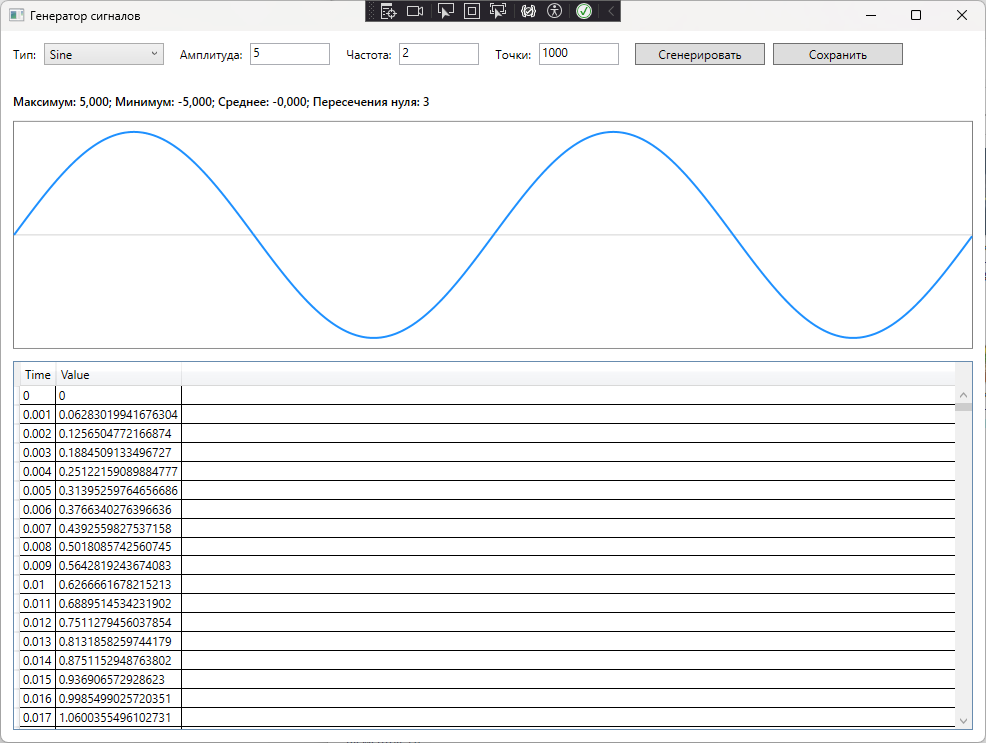
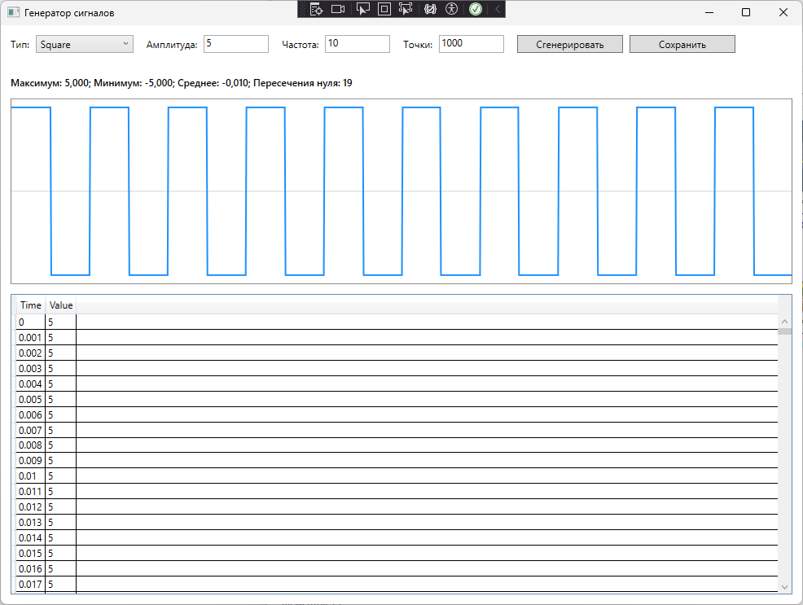
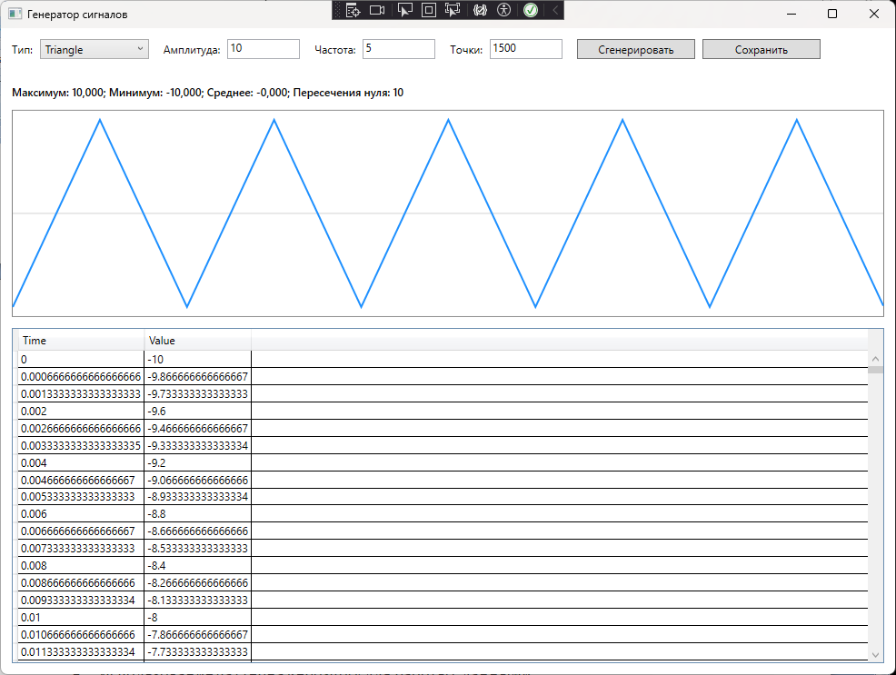
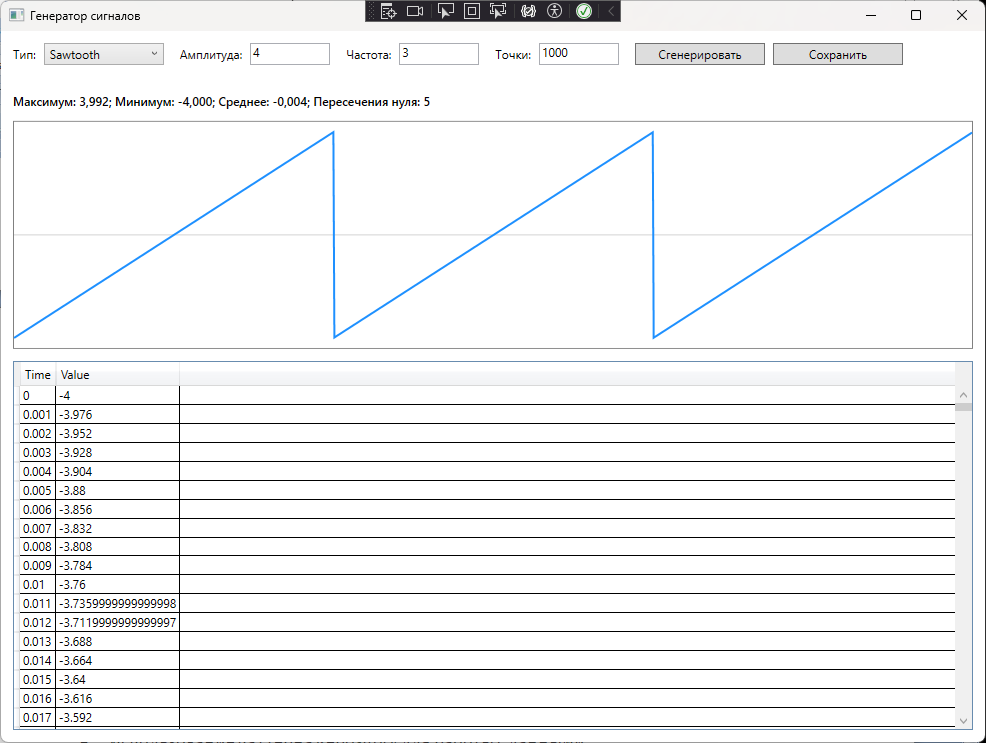
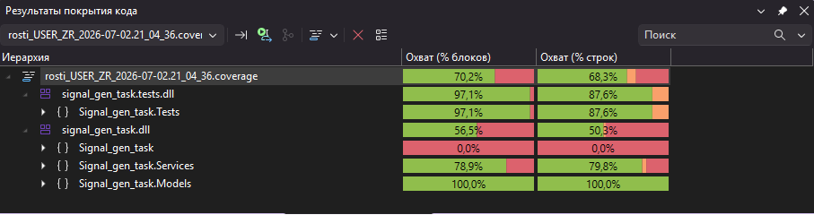
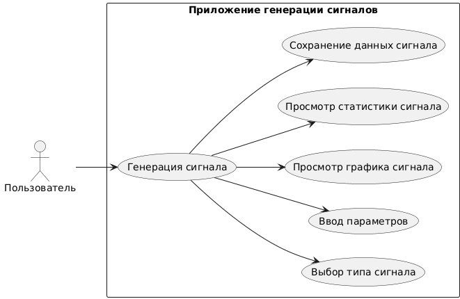

# Signal_generation_task

Приложение предназначено для генерации и обработки простых дискретных сигналов. Пользователь может создать синусоидальный сигнал или меандр, посмотреть рассчитанные точки сигнала в таблице, получить основные характеристики сигнала и сохранить результат в CSV-файл.

## Основной функционал

- Генерация сигналов:
  - Sine (синусоида)
  - Square (меандр)
  - Triangle (треугольный сигнал)
  - Sawtooth (пилообразный сигнал)

- Обработка сигналов:
  - максимальное значение
  - минимальное значение
  - среднее значение
  - количество пересечений нулевой линии

- Визуализация сигналов в WPF

- Сохранение сигналов в SQLite базу данных

- Просмотр сохранённых сигналов

## Системные требования

- ОС: Windows 10 или новее
- Платформа: .NET 10
- Среда разработки: Visual Studio 2026
- Тип приложения: WPF

## Установка и запуск

1. Открыть решение `Signal_gen_task.slnx` в Visual Studio.
2. Выбрать проект `Signal_gen_task` как стартовый.
3. Собрать решение через `Build → Build Solution`.
4. Запустить приложение клавишей `F5`.

## Генерация сигнала

Для генерации сигнала необходимо заполнить поля:

- `Тип` — тип сигнала: `Sine`, `Square`, `Triange`, `Sawtooth`.
- `Амплитуда` — максимальное отклонение сигнала от нуля.
- `Частота` — количество периодов сигнала на интервале времени.
- `Точки` — количество генерируемых точек от `100` до `10000`.

Пример для синусоиды:

```
Тип: Sine
Амплитуда: 5
Частота: 2
Точки: 1000
```

Пример для меандра:

```
Тип: Square
Амплитуда: 3
Частота: 1
Точки: 500
```

После нажатия кнопки `Сгенерировать` приложение выводит таблицу точек сигнала.

## Функции обработки сигнала
После генерации приложение автоматически рассчитывает:
- максимальное значение сигнала;
- минимальное значение сигнала;
- среднее значение сигнала;
- количество пересечений нулевой линии.
Максимум и минимум показывают границы значений сигнала. Среднее значение показывает усредненный уровень сигнала. Количество пересечений нуля показывает, сколько раз сигнал изменил знак.

## Визуализация сигнала

После генерации приложение отображает график сигнала. Синяя линия показывает форму сигнала, а серая горизонтальная линия соответствует нулевому уровню. При изменении размера окна график автоматически перерисовывается.

## Сохранение данных (SQLite)

После генерации сигнал сохраняется в базу данных `signals.db`.

### Что сохраняется:

Таблица Signals:
- тип сигнала
- амплитуда
- частота
- количество точек
- дата создания

Таблица SignalPoints:
- время
- значение
- связь с сигналом

Располагается в файл в директории: `Signal_gen_task\bin\Debug\net10.0-windows\signals.db`

## Просмотр базы данных

Базу можно открыть через:

- DB Browser for SQLite
- Visual Studio (SQLite extension)

## Возможные ошибки и способы устранения (FAQ)

| Ошибка | Причина | Решение |
|---|---|---|
| Некорректное значение поля: амплитуда | В поле введен текст или пустое значение | Ввести положительное число |
| Значение амплитуды должно быть больше нуля | Амплитуда равна `0` или меньше | Ввести значение больше `0` |
| Значение частоты должно быть больше нуля | Частота равна `0` или меньше | Ввести значение больше `0` |
| Количество точек должно быть от 100 до 10000 | Количество точек вне допустимого диапазона | Ввести число от `100` до `10000` |
| Сначала сгенерируйте сигнал | Попытка сохранить данные до генерации | Сначала нажать `Сгенерировать` |

## Тестирование

Проект включает:

### Unit tests (xUnit)

Проверяют:
- генерацию сигналов
- корректность параметров
- обработку сигналов

### Integration tests

Проверяют:
- сохранение в SQLite
- загрузку данных
- корректность связей таблиц

## CI/CD

В проекте настроен GitHub Actions:

- автоматическая сборка
- запуск тестов
- проверка каждого push / pull request 

## Скриншоты

### Генерация синусоиды



### Генерация меандра



### Генерация треугольного сигнала



### Генерация пилообразного сигнала



### Покрытие кода тестами



### Диграмма использования

